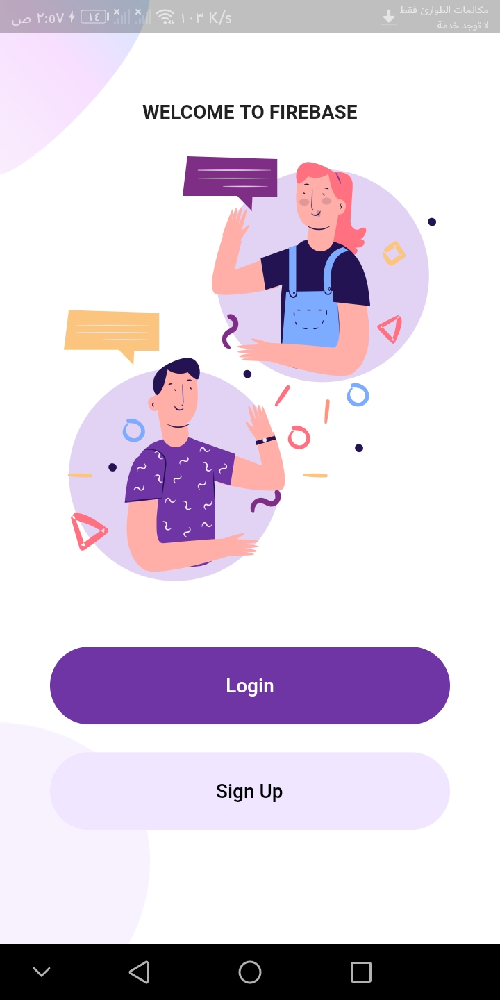
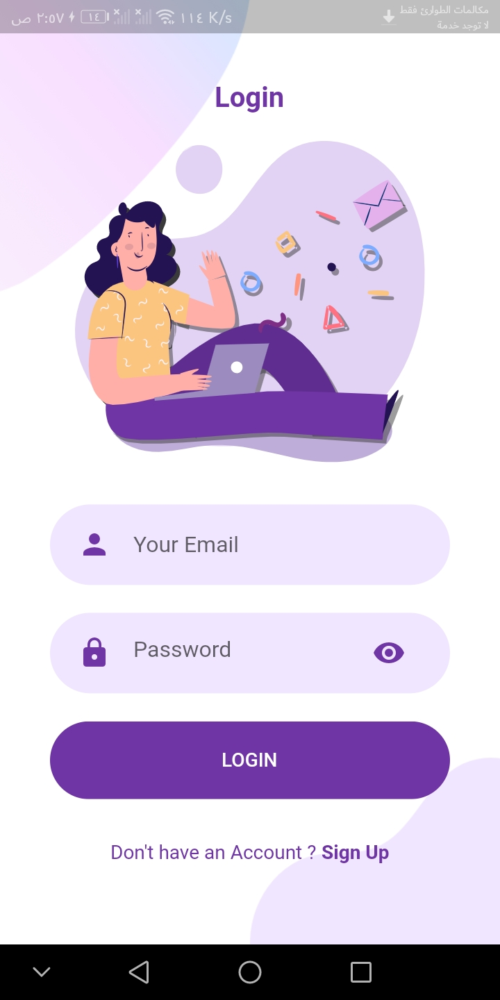
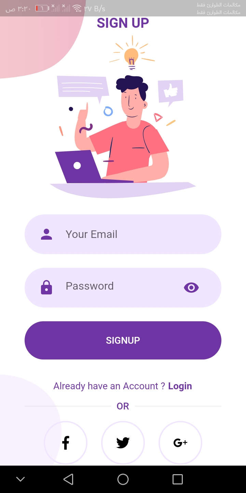
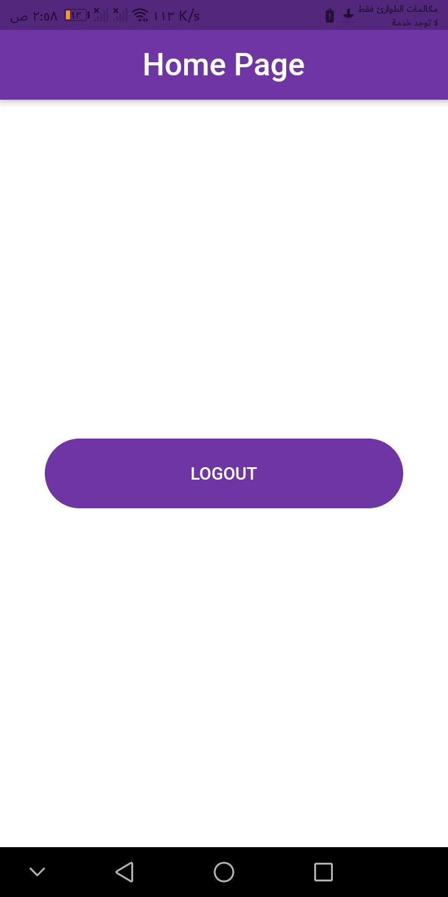
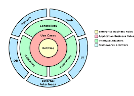

# firebase_auth_tdd_flutter

### In this simple project you will find amazing concept was included and we will talk about here

this ui is inspired by <i>The Flutter Way youtube channal<i>

  
  

  

  

  

  

  

first imagine that you want to build a flutter app, in the normal case or in a more popular case we begin with the design then business logic ended with configure backend.
  <b><i>BUT</i></b> this caused a lot of debugging time and even we can back to edit our UI but the big problem we will face is maintaining the app later we look at the code and say who wrote this and why this here and from where it comes and more.

Here comes the importance of choosing a clean architecture or design pattern that will organize our project. We will talk about Bob’s clean architecture. How can such independence be achieved? on the layered "onion" image below. The outer layer depends on the abstract of the inner layer For example, Entities do not depend on anything, Use Cases depend only on Entities, etc.

  

How to reduce debugging time, here the <b>Test Driven Development</b> approach comes, how it works? You remember in the first we say that the first part of the project is the design right. But with this approach, the design part is the latest part in development. This means that you spend 80% of your time just write the logic and test units and 20% spend on UI, so this work by writing the test unit then run the test which will fail because there is no logic to test after fails we go to write the logic which will make the test unit pass. And so on.

What about dependency injection? You remember when we say that bob’s architecture makes the layer independent from each other. Yeah, then how you will connect between these parts to make one window open to the presentation layer to provide the data. Here dependency injection comes to solve this problem, one instance with a singleton from each business class arrives at the presentation layer, one instance you can use to get all data you need to present, which mean you hide everything about the presentation layer it does not know how you get the data or the server you use, so you can easily in any time to change the data layer or edit it without any effect on the presentation layer. And this is the beauty of bob’s architecture.

State management. In this simple project, we use BLOC to manage the app state, and it’s a great tool to handle the logic away from the user interface.

A new Flutter project.

## Getting Started

This project is a starting point for a Flutter application.

A few resources to get you started if this is your first Flutter project:

- [Lab: Write your first Flutter app](https://flutter.dev/docs/get-started/codelab)
- [Cookbook: Useful Flutter samples](https://flutter.dev/docs/cookbook)

For help getting started with Flutter, view our
[online documentation](https://flutter.dev/docs), which offers tutorials,
samples, guidance on mobile development, and a full API reference.
